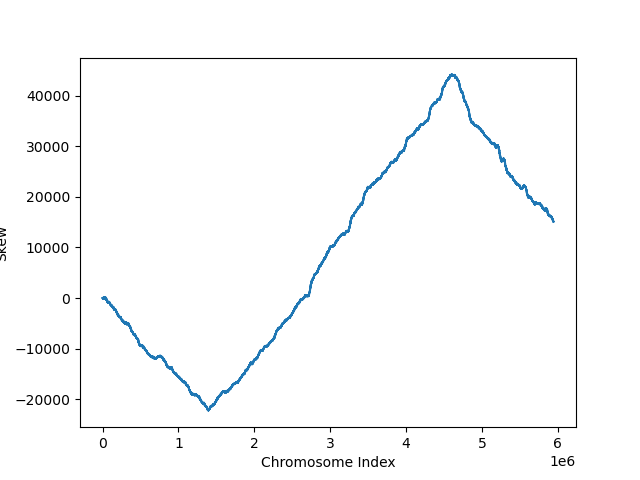

# Bioinformatics-Portfolio
For my bioinformatics class this year, I have been following a textbook called [Bioinformatics Algorithms: An Active Learning Approach](https://www.amazon.com/Bioinformatics-Algorithms-Active-Learning-Approach/dp/0990374637/ref=sr_1_3?dchild=1&keywords=bioinformatics+algorithms+textbook&qid=1608832072&sr=8-3). I used the [video lectures](https://www.bioinformaticsalgorithms.org/lecture-videos) and [problem sets](http://rosalind.info/problems/list-view/?location=bioinformatics-textbook-track) that accompany the course as well. All of my code for this class has been written in OCaml, a language that I have been learning durring this course. The code that I wrote to solve the problems in chapter one of the textbook (problems [BA1A](http://rosalind.info/problems/ba1a/) to [BA1N](http://rosalind.info/problems/ba1n/)) are located in the [problems directory](./problems). Each file includes a link to the problem that the code solves.

After finishing chapter one, I did a project where I extended code that I used in the problem sets to generate a graph that can be used to find the origin of replication of the single chromosome of the E. coli genome. The origin of replication in a chromosome is the place where the palimoreas, the enzymes that copy DNA, begin to copy the chromosome.

The code for this graph can be found in [origin.ml](./origin.ml). In this code, a file called [skew.ml](./problems/skew.ml) is called, which can be found in the problems directory. The graph itself is in [Origin_of_Replication_Graph.png](./Origin_of_Replication_Graph.png), and is shown below. The X axis is the chromosome index, starting from an arbitrary location on the circular E. coli chromosome. The Y axis is the GC skew of the genome, meaning the difference between the number of occurrences of G nucleotides and C nucleotides in the genome. 

Because of the frequency that palimoreas pass over different parts of the chromosome, T nucleotides mutate into C nucleotides at different rates throughout the chromosome so that the skew is minimized at the origin of replication. Therefore, the point on the graph where the skew is minimized is the origin of replication in the E. coli genome.

